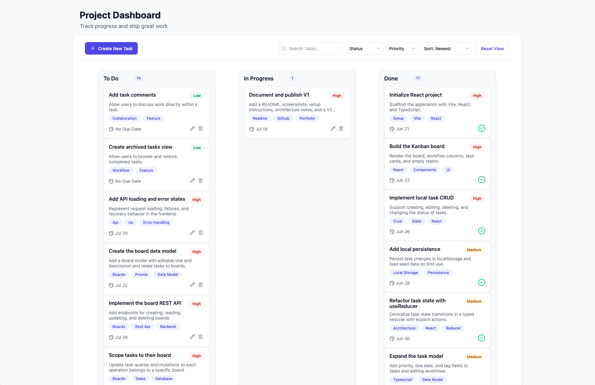

# Sticky Situation | Kanban Board

A full-stack task management application built with React, TypeScript, Express, Prisma, and PostgreSQL.

Users can create, edit, organize, and manage tasks across workflow columns using a modern drag-and-drop interface.



---

## About This Project

Kanban Board is a full-stack task management application built with React, TypeScript, Express, Prisma, and PostgreSQL.

The project demonstrates modern frontend and backend development practices, including a layered API architecture, service-based state management, database persistence, and a reusable design system.

The current release supports task management workflows, drag-and-drop interactions, filtering, sorting, and full CRUD operations.

Future enhancements include multiple boards, authentication, board ownership, task assignment, and user management.

---

## Tech Stack

### Frontend

- React
- TypeScript
- Vite
- CSS

### Backend

- Node.js
- Express
- TypeScript

### Database

- PostgreSQL
- Prisma ORM

---

## Architecture

The application follows a layered architecture that separates UI concerns, business logic, API concerns, and persistence.

```text
[ Frontend ]

React Components
        ↓
Frontend Service Layer

──────── HTTP / REST API ────────

[ Backend ]

Express Routes
        ↓
Controllers
        ↓
Services
        ↓
Prisma
        ↓
PostgreSQL
```

---

## Key Technical Decisions

### Frontend Service Layer

Task persistence is abstracted behind a frontend service layer.

This allowed the application to begin with local persistence and later migrate to a REST API without significant changes to the React components.

### Layered Backend Architecture

The backend separates routes, controllers, and services.

This keeps HTTP concerns isolated from business logic and persistence concerns while making the codebase easier to maintain and extend.

### PostgreSQL + Prisma

Prisma was selected to provide type-safe database access and schema management while PostgreSQL serves as the application's primary data store.

### Design Token System

Colors, spacing, typography, shadows, and component styling are centralized through reusable design tokens to maintain visual consistency across the application.

---

## Current Features

### Task Management

- Create, edit, and delete tasks
- Drag and drop workflow management
- Priority and due date tracking
- Task tagging

### Task Discovery

- Search tasks
- Filter by status
- Filter by priority
- Sort tasks

### Full-Stack Functionality

- REST API backend
- PostgreSQL persistence
- Prisma ORM integration
- Seeded development database

### User Experience

- Reusable design token system
- Consistent modal workflows
- Modern Kanban board interface

---

## Additional Screenshots

### Create Task


### Edit Task


### Delete Confirmation


### Drag and Drop Workflow


---

## Getting Started

### Clone the Repository

```bash
git clone <repository-url>
```

### Install Dependencies

```bash
cd kanban-board
npm install
```

### Configure Environment Variables

Create a `.env` file in the project root.

```env
DATABASE_URL=your_database_url
```

### Run Database Migrations

```bash
npx prisma migrate dev
```

### Seed the Database

```bash
npx prisma db seed
```

### Start the Frontend

```bash
npm run dev
```

### Start the Backend

```bash
npm run dev:server
```

---

## Planned Enhancements

### Boards

- Multiple boards
- Board creation
- Board editing
- Board deletion
- Board descriptions
- Board switching

### Navigation

- React Router integration
- Boards listing page
- Individual board pages

### Authentication

- User registration
- User login
- User logout
- Protected routes

### Ownership

- Board ownership
- User-owned boards
- User-owned data

### Task Assignment

- Assign tasks to users
- Display assignee information
- Filter tasks by assignee

### User Management

- User profile page
- Update username
- User settings page

### Additional Improvements

- Loading states
- Error states
- Automated testing
- Deployment
